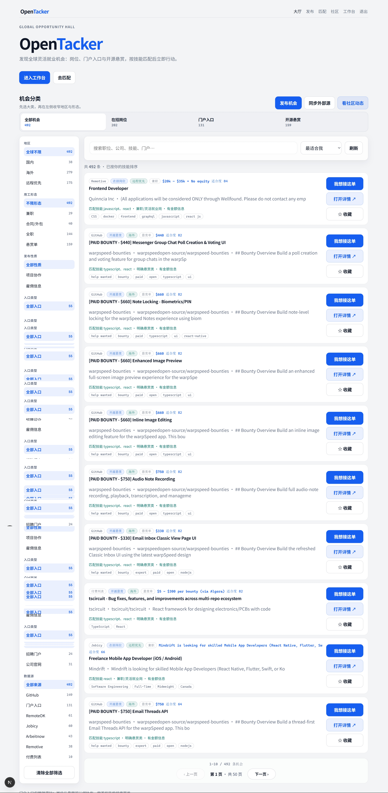
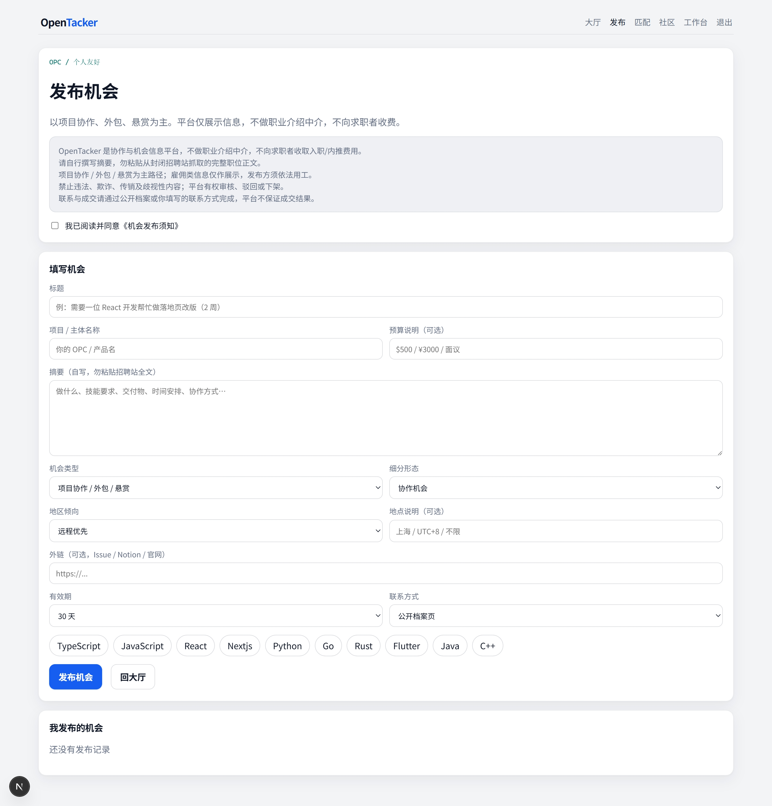
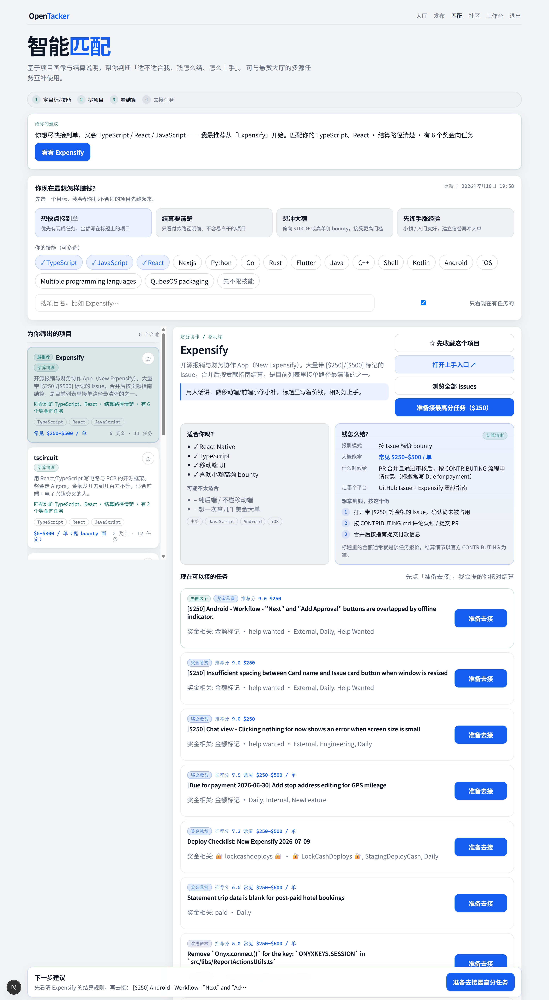
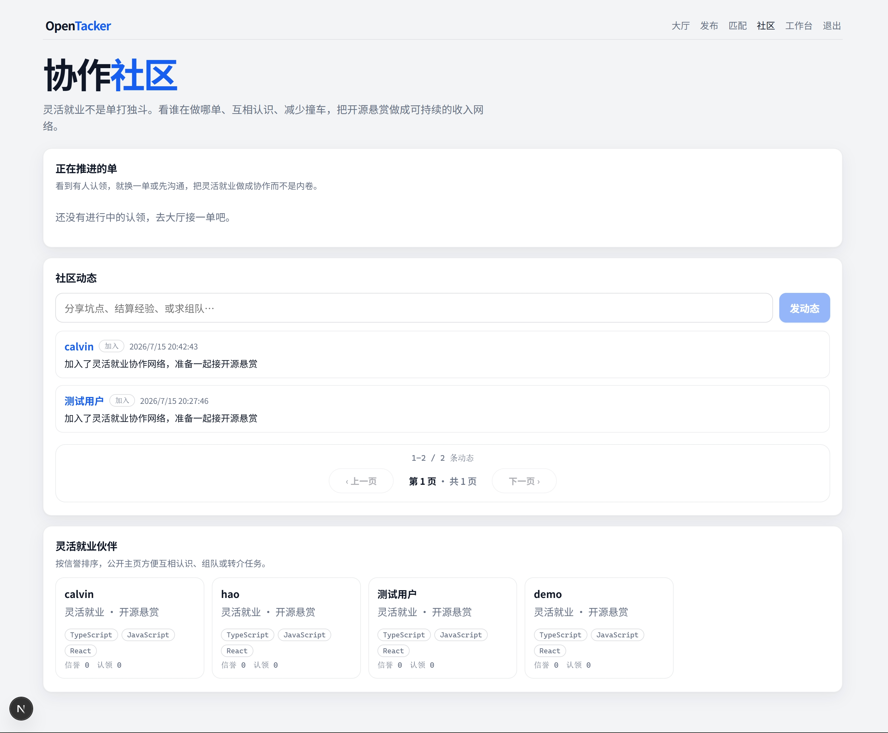
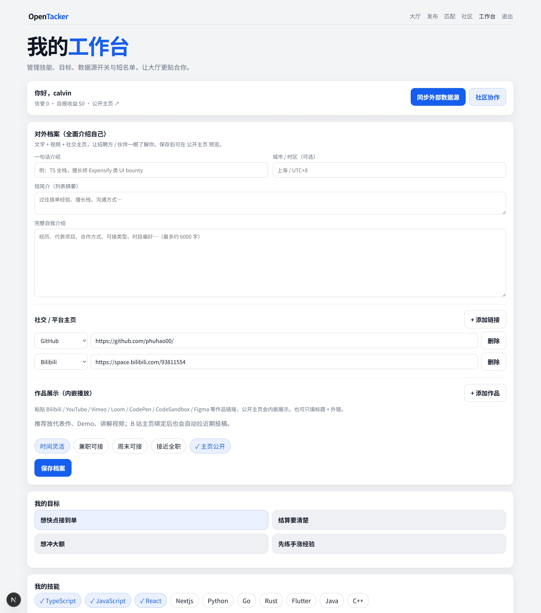
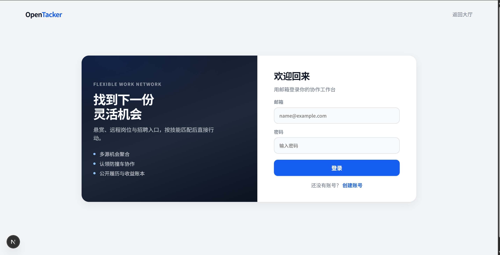
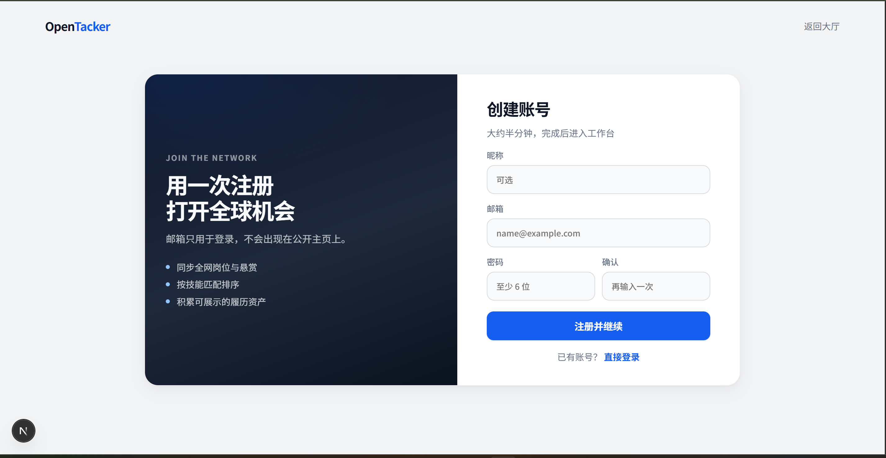

# OpenTacker

**全球灵活就业与招聘聚合平台** — 开源悬赏 · 远程/兼职岗位 · 招聘门户与公司 careers 入口 · 技能匹配 · 认领协作 · 公开履历与收益账本。

**Global flexible-work & recruiting aggregation** — OSS bounties, remote/part-time openings, job-board & career-page portals, skill matching, collaborative claims, public profiles & earnings ledger.

[](LICENSE)
[](web/)
[](src/opentacker/)
[](web/)

<p align="center">
  
</p>

<p align="center">
  <b>机会大厅</b> · 多源机会一站聚合，按大类 / 地区 / 用工形态 / 数据源筛选
</p>

本地演示：`cd web && npm run dev` → [http://localhost:6700](http://localhost:6700)

---

## Why OpenTacker / 为什么做

灵活就业的机会散落在 GitHub Issue、Algora、RemoteOK、各大招聘站与公司官网之间。OpenTacker 把它们收进**同一个大厅**，再配上匹配、认领、社区与履历，让「找到活 → 接上 → 留下痕迹」形成闭环。

Flexible work opportunities are scattered across GitHub issues, Algora, RemoteOK, job boards, and company career pages. OpenTacker brings them into **one hall**, then adds matching, claims, community, and profiles so “find → claim → leave a trail” becomes a loop.

上游灵感：[paid-open-source-projects](https://github.com/kunovsky/paid-open-source-projects)。本仓库包含 **Next.js Web（主产品）** 与 **Python 追踪器（报告/快照）**。

---

## Highlights / 核心能力

| | 中文 | English |
|---|------|---------|
| 🔎 Discovery | 多源悬赏、远程岗、门户入口 | Multi-source bounties, remote jobs, portal jumps |
| 📝 Publish | OPC / 个人自助发帖（轻审核） | User-published opportunities (light moderation) |
| 🧭 Taxonomy | 大类 → 地区 → 用工形态 → 数据源 | Bucket → region → work type → source |
| 🎯 Match | 按技能与目标排序推荐 | Skill- & goal-based ranking |
| 🤝 Collaborate | 认领防撞车、社区动态 | Claims + activity feed |
| 👤 Profile | 公开主页、信誉、收益账本 | Public profile, reputation, earnings |
| ⚙️ Tracker | CLI 报告、定时跑、JSON 快照 | CLI reports, schedule, JSON snapshots |

**数据源（Web）**：付费开源列表 · GitHub Search · Algora · RemoteOK · Remotive · Jobicy · Arbeitnow · 门户目录 · 社区 UGC  

**合规边界**：只用公开 API / 策展入口 URL / 用户自填；**不做**封闭招聘站正文爬取，也**不是**职业介绍中介。详见下方 [Compliance](#compliance-note--合规说明)。

---

## Product tour / 产品导览

更多原图见 [`data/images/`](data/images/)。

| 界面 | 说明 |
|------|------|
| [机会大厅](data/images/hall.jpg) | 悬赏 / 岗位 / 门户分层筛选与认领 |
| [发布机会](data/images/publish.jpg) | OPC 发帖、须知确认、技术标签 |
| [智能匹配](data/images/match.jpg) | 目标 + 技能 → 项目与可接任务 |
| [协作社区](data/images/community.jpg) | 动态流与灵活就业伙伴墙 |
| [工作台](data/images/dashboard.jpg) | 档案、GitHub/Bilibili、收益账本 |
| [登录](data/images/login.jpg) / [注册](data/images/register.png) | 邮箱账号，进入协作工作台 |

<details>
<summary>展开全部截图 / Expand screenshots</summary>

### 机会大厅 · Hall


### 发布机会 · Publish



### 智能匹配 · Match



### 协作社区 · Community



### 工作台 · Dashboard



### 登录 / 注册 · Auth

| Login | Register |
|:---:|:---:|
|  |  |

</details>

---

## Quick start / 快速开始

### 1) Web（推荐主产品）

```bash
cd web
cp .env.example .env   # 必填 AUTH_SECRET；可选 GITHUB_TOKEN、MODERATOR_EMAILS
npm install
npx prisma db push
npm run dev            # http://localhost:6700  (Turbopack)
```

首次同步外部数据（可选）：

```bash
cd web
npx tsx scripts/sync-jobs.ts       # RemoteOK / Remotive / Jobicy / Arbeitnow
npx tsx scripts/sync-portals.ts    # 招聘门户 + 公司 careers 入口
# 或登录后在大厅点「同步外部资源」（需审核员权限）
```

常用环境变量见 [`web/.env.example`](web/.env.example)：

| 变量 | 用途 |
|------|------|
| `DATABASE_URL` | SQLite（默认 `file:./dev.db`） |
| `AUTH_SECRET` | NextAuth 密钥 |
| `NEXTAUTH_URL` | 默认 `http://localhost:6700` |
| `GITHUB_TOKEN` | 提高 GitHub / 嵌入配额（可选） |
| `MODERATOR_EMAILS` | 审核员邮箱，逗号分隔（可选） |

### 2) Python tracker（付费开源报告）

```bash
python -m venv .venv
# Windows: .venv\Scripts\activate
# macOS/Linux: source .venv/bin/activate

pip install -e ".[dev]"
cp .env.example .env          # 设置 GITHUB_TOKEN
# 编辑 config.yaml → skills

opentacker run
opentacker show               # 或打开 reports/latest.md
```

| Command | Description |
|---------|-------------|
| `opentacker list` | 仅解析付费开源列表 |
| `opentacker run` | 完整追踪 + 报告 |
| `opentacker run --all` | 忽略 skills 过滤 |
| `opentacker show` | 打印最新 Markdown 报告 |
| `opentacker schedule` | 按 `config.yaml` 本地定时 |

---

## Web map / 前端路由

| Path | 功能 |
|------|------|
| `/` | 机会大厅 |
| `/publish` | 发布机会（UGC） |
| `/match` | 智能匹配（基于 tracker 快照） |
| `/community` | 协作社区 |
| `/dashboard` | 个人工作台 |
| `/u/[id]` | 公开主页 |
| `/moderation` | 审核台（审核员） |
| `/login` · `/register` | 登录 / 注册 |

---

## Stack / 技术栈

- **Web**：Next.js 15 · React 19 · NextAuth · Prisma · SQLite · TypeScript  
- **Tracker**：Python · CLI · Markdown/JSON 报告  
- **Sources**：可插拔 fetcher，注册于 [`web/lib/sources/sync.ts`](web/lib/sources/sync.ts)  
- **Taxonomy**：[`web/lib/taxonomy.ts`](web/lib/taxonomy.ts)

---

## Configuration / 配置

### Tracker — `config.yaml`

- `skills` — 技术栈过滤  
- `github.bounty_labels` / `opportunity_*` — 机会启发式  
- `schedule.cron` — 本地定时（默认每天 09:00）  
- `output.*` — 报告与历史目录  

### 扩展数据源

1. 在 `web/lib/sources/` 新增 fetcher  
2. 挂到 `ALL_FETCHERS`（[`sync.ts`](web/lib/sources/sync.ts)）  
3. 门户种子见 [`portal-directory.ts`](web/lib/sources/portal-directory.ts)

---

## Compliance note / 合规说明

| Allowed ✅ | Not in default product ❌ |
|-----------|---------------------------|
| 官方 / 公开 API 与 RSS | 批量爬取 BOSS / 智联 / LinkedIn 封闭职位正文 |
| 策展的招聘站 / careers **入口 URL** | 无授权存储专有职位全文 |
| 用户自填机会帖 | 充当持证职业介绍中介 |
| 项目 / 自由协作认领 | 向求职者收取中介 / 推荐费 |

国内主流招聘站职位正文通常需在源站登录查看；本仓库以**跳转入口 + 开放数据 + 用户自填**为主路径。

### 用户发布（UGC）

- OpenTacker **不做职业介绍中介**：不撮合劳动合同、不保证入职、不向求职者收费。  
- 发帖须登录；项目协作为主，雇佣类须额外确认免责声明。  
- 新账号 / 低信誉进待审；可举报；审核员可下架。  
- 请自行撰写摘要，禁止粘贴封闭招聘站全文抓取内容。  
- 外部源同步仅限审核员或 CLI（`MODERATOR_EMAILS` / `role=moderator`）。

本说明不能替代律师意见。若产品转向收费猎头或国内全职撮合，需另行评估属地人力资源服务许可。

---

## Typical flow / 推荐用法

1. 注册 → 在工作台完善技能与目标  
2. 同步机会（或等待已有数据）  
3. 大厅按「在招岗位 / 门户 / 悬赏」筛选，或去「匹配」  
4. 认领协作，或跳转源站投递  
5. 收款后记入收益账本，完善公开主页  

开源 bounty 建议从结算路径清晰的项目（如 Algora 生态）练手。

---

## Project layout / 目录

```
opentacker/
├── config.yaml                 # tracker config
├── src/opentacker/             # Python CLI pipeline
├── reports/                    # Markdown reports
├── data/
│   ├── history/                # JSON snapshots
│   └── images/                 # README product screenshots
├── web/                        # Next.js app (port 6700)
│   ├── app/                    # routes & APIs
│   ├── components/             # hall, community, dashboard…
│   ├── lib/sources/            # multi-source fetchers
│   ├── lib/taxonomy.ts         # classification system
│   ├── prisma/                 # SQLite schema
│   └── scripts/                # sync-jobs, sync-portals…
└── tests/
```

---

## License

MIT — see [LICENSE](LICENSE).
